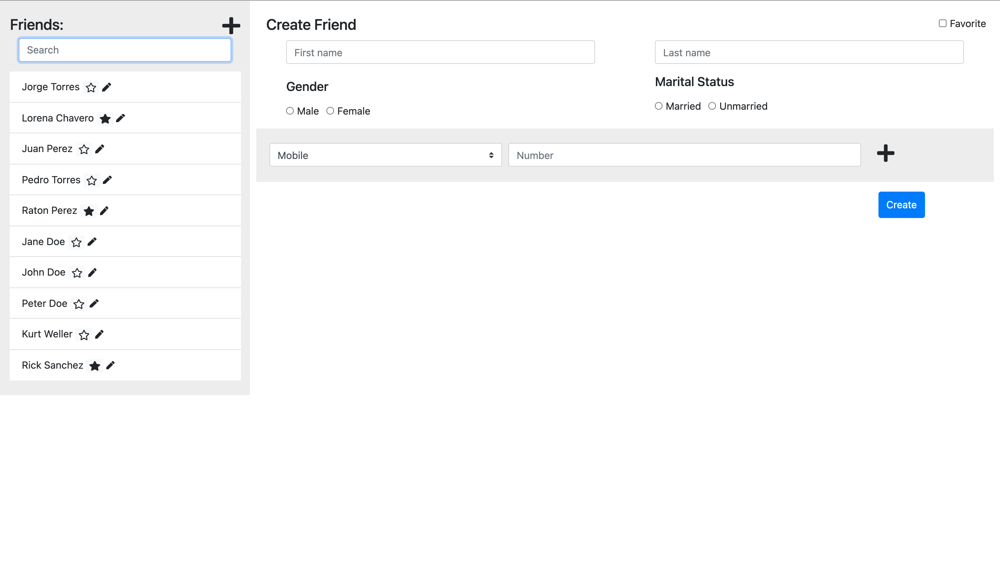

# React Project - Friends List 

>  In this project I built an app that consumes an API to make basic CRUD operations with friend objects.
## Screenshot

## Built With

- React
- Bootstrap
- Fontawesome
- Axios
- VSCode

## Author:

### 👨‍💻 Jorge Torres

- Github: [Jorge Torres](https://github.com/Yors-git)
- Linkedin: [Jorge Torres](https://www.linkedin.com/in/jtbribiesca/)
- Twitter: [@Yors_82](https://twitter.com/Yors_82)

## 🤝 Contributing

Contributions, issues and feature requests are welcome!

Feel free to check the issues page

## Show your support

Give a ⭐️ if you like this project!

## 📝 License

All rights reserved to Jorge Torres